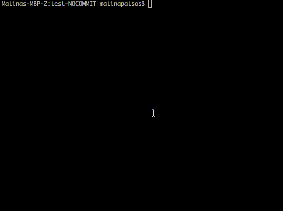

# First Project: Hangman

**First Submission Due November 29, 2023 End Of Day**

For your first project, you will be creating the classic word game, Hangman, using Node.js. Hangman is a word game where the computer picks a word or phrase, and the player must guess what the word or phrase is, letter-by-letter. If she make too many guesses, the hangman is "hung" and she will lose.

If you are not familiar with the game, you can [watch this video](https://www.youtube.com/watch?v=j-pBzBvJVKc) and [play the game here](https://hangmanwordgame.com).



## Project Goals

- To put together and make practical use of what was taught in class.
- To practice the operations in creating a project, like setting up an application, maintaining your own git repository and writing a _README.md_.
- To build a portfolio piece to show off to potential employers.

This project will put together these topics that were covered in class:

- Variables and constants
- Primitive data types (strings, numbers, booleans)
- Control flow and conditionals (if statements)
- Collections (arrays and objects)
- Functions

## Getting Started

You will need to [create a new public Github repository](https://help.github.com/en/articles/create-a-repo) for this project. Name your new repository "hangman". Once the new repository is set up, [clone the Github repository](https://help.github.com/en/articles/cloning-a-repository). Then type `cd hangman` in either your terminal or Git Bash.

Inside this folder, create a new file called _package.json_. Inside the file, copy and paste the following. Replace where is says `<YOUR NAME>` with your name and `<YOUR USERNAME>` with your Github username.

```json
{
  "name": "hangman",
  "version": "1.0.0",
  "engine": {
    "node": "^18.18"
  },
  "type": "module",
  "main": "index.js",
  "author": "<YOUR NAME>",
  "repository": {
    "type": "git",
    "url": "git+https://github.com/<YOUR USERNAME>/hangman.git"
  }
}
```

For this project, you will need to be able to read command line input. We suggest that you use the _[readline-sync](https://www.npmjs.com/package/readline-sync)_ library, which you can install by running this in your terminal:

```shell
npm install --save readline-sync
```

However, you are welcome to use Node's built in _[readline](https://nodejs.org/docs/latest-v18.x/api/readline.html)_ module or [any other library](https://www.npmjs.com/search?q=prompt) of your choice.

Inside the _JSFunFall2021_ repository, we have created a word bank file for you. This is the list of all the possible words that the computer can pick at random. Copy the _projects/hangman/word-bank.js_ file and paste it into your new repository.

Create a new file called _index.js_. This is the main file for your first project. You will be writing your code in this file. The first two lines should look like this:

```javascript
import prompt from "readline-sync";
import wordBank from "./word-bank.js";
```

The first line will include the _readline-sync_ library. The second will import all the words from our word bank into an array.

Create a file called _.gitignore_ inside of the root of your project. It contains all the folder and files that you do not want to publish to git. You should ignore the _node_modules_ folder like this:

```
node_modules/
```

You should also create a _README.md_ file, which you should write in [Markdown](https://github.com/adam-p/markdown-here/wiki/Markdown-Cheatsheet). It should explain what the project is and how to play the game. You can find [a sample README here](https://www.makeareadme.com/).

## Playing the Game

In Visual Studio Code, open your terminal. To start the game, run `node .` To end the game, press `ctrl + c`.

You will display messages to the user with `console.log`. For example:

```javascript
console.log("\nWelcome to Hangman!\nPress ctrl+c to stop\n");
```

The new line character (`\n`) is like pressing "enter" in text editors like Microsoft Word or Visual Studio Code. Use this to make your text output easier to read.

The player will guess a letter over the command line. She will type a single letter and hit `enter`. To get input from the player with the _readline-sync_ library, you will do something like this:

```javascript
const letter = prompt.question("Please guess a letter: ");
```

[You can read the full _readline-sync_ documentation here](https://www.npmjs.com/package/readline-sync).

## Project Requirements

### Application Requirements

- Your application must start over the command line with `node .`
- Your application should not crash at any point.

If your instructors cannot grade your project because we cannot start or run your application, **it will be an automatic failure.**

### UI Requirements

- Use words from a word bank (_word-bank.js_). For each round, a word must be chosen at random.
- When the game starts, let users know that they can stop the game by pressing `ctrl + c`.
- Throughout the game, the user should know:
  - What letters they have guessed correctly
  - Where, in the word, the correct letters are
  - Where, in the word, contains a letter that hasn't been guessed yet
  - How many guesses are left
- Your game must be case insensitive. This means that when the player guesses a letter, the computer will treat lower case and upper case versions of a letter as the same character.
- If the user guesses the same letter more than once, this should not count as an incorrect guess. Let the user know that they already guessed the letter.
- The game will stop when either a.) the player has guessed all the letters or b.) the player has made six incorrect guesses.
- When the game finishes, let the play know if they have won and display the answer (the word the computer picked).
- Please make sure your game text is easily readable. Use the new line characters (`\n`) where needed.

### Coding Requirements

- You must have at least three arrow functions (but we recommend using arrow functions for all functions).
- You must use _let_ or _const_ instead of _var_.

### Code Quality

While you will not fail if you do not meet these quality requirements, we will ask you to resubmit your work if it is not up to a professional standard. One of the goals of this project is to help you build a portfolio. Just like an interviewer will judge you on your attire, employers will judge you on the neatness of your code.

- You should have _README.md_ written in Markdown. It should explain the purpose of the project, describe how to play the game, give instructions on how to install and start your project and credit yourself as the author. Here are some resources on creating _README.md_ files:
  - [Make a README](https://www.makeareadme.com/)
  - [Markdown cheatsheet](https://github.com/adam-p/markdown-here/wiki/Markdown-Cheatsheet)
- Add anything that should not be committed to your _.gitigore_ file. Your _node_modules_ folder should be ignored.
- Choose descriptive and specific names for variables, constants, functions and anything else that is named.
- You must not leave any debugging statements in your code. This means when you commit your code, remove any `console.log` statements that are not intended for the user to see.
- Only have actual comments within comment tags. Do not commit code that you commented out for debugging purposes.
- Remove any code that is not being used. (This affects application load time as well as code quality.)
- Use proper indentation. (Prettier can take care of this.)

### Bonus Points

- After the game is complete, ask the user if they would like to play again.
- If the user plays again, keep track of the wins and loses.

### Hints

- First, outline your project using pseudo-code. Here is an example:

```js
// Start of Loop
  // Ask user to enter a letter
// Exit loop when ______

if (/* user won */) {
  // Display success message
} else { // user lost
  // Display game over message
}
```

- Next, its recommend to break up each step into a function. To improve the readability and maintainability of the code, it's essential to break it down into smaller, reusable functions or modules that handle specific tasks. These functions should perform individual actions, such as checking if a letter is in the word or updating the display. Here are some suggestions for functions that can be created:
- _getRandomWord_: This function selects a random word from the word bank.
- _initializeDisplay_: This function initializes the display that shows the progress of the game.
- _updateDisplay_: This function updates the display after each guess.
- _checkGuess_: This function checks if the guessed letter is in the word.
- _updateGuesses_: This function updates the number of remaining guesses.
- _isGameOver_: This function checks if the game is over.

  These functions will make the code easier to read and maintain.

- If you need to cheat so that you can develop and test a winning round, temporarily make your word bank a single word you know. For example, you can do this (but be sure to undo when you commit your code):

```javascript
import prompt from "readline-sync";
// import wordBank from "./word-bank.js";
const wordBank = ["win"];
```

- I completed this project with a _while_ loop.
- You can pick a random word with _Math.random_.
- You can use _console.clear()_ to clear all the text on the screen.

## Project Help

If you need help, please schedule a 1-on-1 with your instructors or any of the CanCode Communities staff who is available to help. You can reach out to your instructors on Teams or by email.

## Project Submission

Please email a link to your Github repository to both Matina (matina@albanycancode.org) and Jamal (jamal@albanycancode.org). If you have not completed your project, please turn in what you have. **Not turning anything in is the worst thing you can do.**

## Project Resubmission

You may resubmit this project again for a better grade. In order to resubmit, you must have made a valid attempt. (That is, and you must have followed all the steps in the _Getting Started_ documentation, your app must run, and you have started some of the requirements). You have until the last day of class to resubmit your project.
